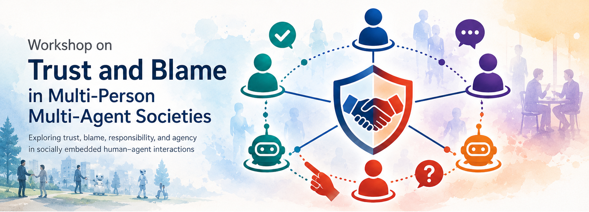

# TBSA 2026_2nd Program on 16th Nov. 2026

TBA

<!--

## Summary
- Venue: TBA
- Date and Time: March 10th Morning Half Day (9:00–12:30)
- 1 Invited Talk and 5 Accepted Papers
- The presentation time for accepted papers should be 15 minutes, including time for Q and A.

## Program Schedule

According to [the general program of Persuasive 2026](https://virtualcom-designlab.github.io/TBSA2026/program.html#persuasive-2026-ws-day-program), 
we change the program as follows.

in the case of hybrid: [Zoom Link](https://kansai-u-ac-jp.zoom.us/j/8846013684?pwd=T3JGMmNzcUV4RTlLY1E0Y0VXa1ljQT09)

- [TBSA Photo Page using the password](http://lab.yoneyone.net/tbsa/gdrivelink.html)
(Use tbsa as login user name, and use password as we announced in the workshop.)
- [Persuasive Official Photos](https://photos.google.com/share/AF1QipMccRy060h9CfW_RbYJXS1E7X_eGA3uqlbJ5o1SADC5Ug1n9KIBqtkqF5TJKl2GsQ?pli=1&key=Q0xaMnlmeTFxbXhXaUNMaGQ5cVlqMjhvZTZNenJ3)

| Time    | Presenter    | Title   |
| :-------- | :--------- | :------- |
| 09:00-09:10     | Organizers       | Opening    |
| 09:10-09:40     | [Invited Talk:](invited.md) |  [Technology Acceptance and Autonomy: How Should We Understand Technologies That Transform the Mind?](invited.md)    by Dr. Yu Nishitsutsumi   |
| 09:40-09:55     | Ryo Uehara  | Philosophical Persuasion: How Technology Reshapes Intuitions on Reality and Agency    |
| ~~09:55-10:30~~     | ~~Break Time~~       | ~~(Official Morning Tea)~~    |
| ~~10:30-10:45~~     | ~~Tomoko Yonezawa~~    | ~~Negative Aversion and Real Reliability for Building Familiar Human-Agent Relationships~~    |
| ~~10:45-11:00~~     | ~~Kentaro Meiseki~~     | ~~Trust and Behavioral Change in Comments by Confirmation Message Agent **Online**~~   |
| 09:55-10:10     | Tomoko Yonezawa    | Negative Aversion and Real Reliability for Building Familiar Human-Agent Relationships    |
| 10:10-10:25     | Kentaro Meiseki     | Trust and Behavioral Change in Comments by Confirmation Message Agent **Online**   |
| 10:30-11:00     | Break Time       | (Official Morning Tea)    |
| 11:00-11:15     | Discussion and Mingling       | --    |
| 11:15-11:30     | Hirotake Yamazoe       | Trust and Responsibility Attribution Toward Automated Ambulances: A Preliminary Survey of Japanese Fire Service Personnel    |
| 11:30-11:45     | Kunifumi Saito       | Governing the Dynamic Dead: Civility and Persuasion in Posthumous Digital Personas    |
| 11:45-12:15     | Discussions  | (Trust and Blame in Social Agents and Technology, Ethics and Guidelines in Future)    |
| 12:15-12:20     | Organizers | Closing    |
| 12:30-13:30     | -- | Official Lunch    |

### HAI 2026 common WS day program

| Time    | Schedule    |
| :-------- | :--------- | 
|08:00 – 9:00		|__Registration__ |
|09:00 – 10:30		|Workshops, Tutorials|
|10:30 – 11:00		|**Morning Tea** |
|11:00 – 12:30		|Workshops, Tutorials|
|12:30 – 13:30		|**Lunch**|
|13:30 – 15:00		|Workshops, Doctoral Consortium |
|15:00 – 15:30 		|**Afternoon Tea** |
|15:30 – 17:00		|Workshops, Doctoral Consortium |
|17:00 – 18:00		|Steering Committee Meeting / PT2026 Organization Meeting|

---
[back to top page](index.html)
____

----

## All Workshops, Tutorials, and Doctoral Consortium in Persuasive 2026

### Morning Half Day (9:00–12:30)

- Room 593
The 1st International Workshop on Trust and Blame in Social Agents (TBSA 2026)
(6 presenters)

- Room 594
Tutorial: Self-Regulated Learning Tool for Academic Success

### Afternoon Half Day (13:30–15:00)

- Room 593
Joint Workshop:
Personalizing Persuasive Technologies Workshop 2026 (PPT 2026) +
The 2nd International Workshop on Upholding Ethical Designs (I-WOULD 2026)
(3 presenters)

- Room 594
Doctoral Consortium
(2 presenters)

### Full Day (9:00–17:00)

- Electrical Engineering Room
The 3rd BTI International Workshop (BTIW3)
(12 presenters)

- Auditorium
BCSS Full-Day Workshop
(approximately 10 presenters)

-->

---
[back to top page](index.html)

